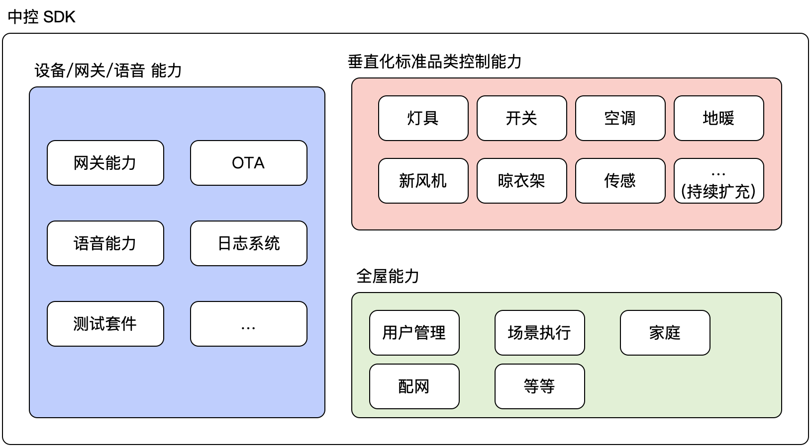

# 中控 SDK

Android 中控 SDK 是一套融合了网关、日志系统、语音功能以及 ota 升级等功能的开发套件，开发者可以基于该 SDK 实现如下特色能力：

1. 实现家庭管理、设备列表、房间列表、场景执行等应用场景，实现全屋智能功能。
2. 垂直化 品类的控制。例如 灯具类、开关、空调、晾衣架、窗帘、新风机、温控器、传感器等品类的垂直化接口封装，帮助开发者快速适配各种品类的控制。
3. 设备入网、网关能力、语音控制、OTA 升级等操作。

## 应用场景

本方案适用于 对 **传统带屏的 Android 设备** 的智能化改造。在传统的带屏 Android 设备基础上，通过在原有 ROM 内集成 Tuya 的开发包，并增加 Tuya 的硬件通信模块，实现对网关、设备、语音等的控制能力。

## **目标领域**

如 带屏中控、带屏场景面板、可视对讲、带屏音箱、电视 等；

## 适用范围

1. 产品基于 Android 系统
2. 带屏的 Android 设备
3. 需要在屏上显示设备、操作设备
4. 有一定底层驱动开发能力及上层交互开发能力

## 中控 SDK 能力

## 中控 SDK 特色

1. 设备品类控制接口垂直化设计：

	相比之前 SDK , 大大减少客户的开发接入成本

2. 设备控制支持品类维度：

	目前支持：开关、插座、空调、窗帘、传感器等 15+ 品类，并持续迭代扩充品类

	客户也可以根据协议自己独立开发品类

3. 设备授权激活与其他功能独立、解耦依赖

4. 移除无关功能，开发功能更专注

5. 支持搭配 IPC SDK ，接入摄像头相关能力