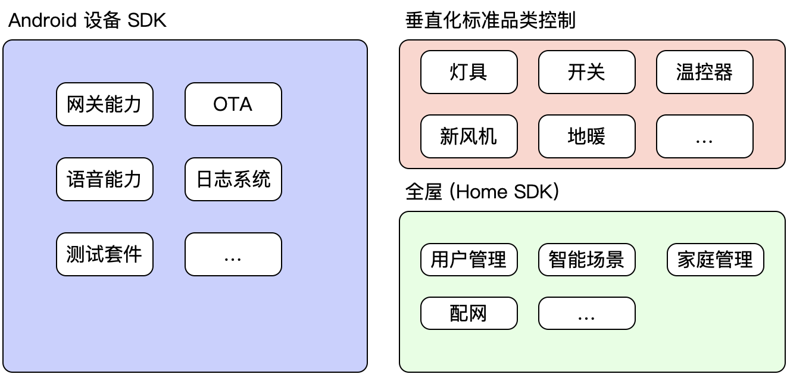

# 中控 SDK

Android 中控 SDK 是一套融合了网关、日志系统、语音功能以及 ota 升级等功能的开发套件，开发者可以基于该 SDK 实现入网、语音控制、固件和 apk 升级等操作。

同时可以结合 Home SDK 的功能实现家庭管理、设备列表、房间列表、智能场景等应用场景，实现全屋智能的应用场景。

## **应用场景**

本方案适用于 对 **传统带屏的 Android 设备** 的智能化改造。在传统的带屏 Android 设备基础上，通过在原有 ROM 内集成 Tuya 的开发包，并增加 Tuya 的硬件通信模块，实现对网关、设备、语音等的控制能力。

## **目标领域**

如 带屏中控、带屏场景面板、可视对讲、带屏音箱、电视等；

## **适用范围**

1. 产品基于 Android 系统
2. 带屏的 Android 设备
3. 需要在屏上显示设备、操作设备
4. 有一定底层驱动开发能力及上层交互开发能力

## SDK 能力

Android 设备 SDK 主要提供：

| 能力     | 功能                                                        |
| -------- | ----------------------------------------------------------- |
| 网关     | 如网关的启动、入网、获取设备虚拟 id、DP 点 下发/上报 功能。 |
| 日志系统 | 日志的获取保存等                                            |
| 测试套件 | zigBee 测试库                                               |
| 语音功能 |                                                             |
| OTA 功能 |                                                             |

其他能力：如用户管理、家庭管理、场景等操作结合 Tuya Home SDK 完成。

另外中控 SDK 方案提供了垂直化标准品类的控制，帮助开发者快速实现设备控制。