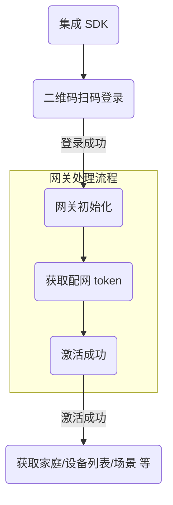

# 推荐的开发流程:

## 处理流程：

```mermaid
graph TD
    id(集成 SDK)
    id2(二维码扫码登录)
    id3(网关初始化)
    id4(获取配网 token)
    id5(激活成功)
    id6(获取家庭/设备列表/场景 等)
    id --> id2
    id2 --登录成功--> id3
    subgraph 网关处理流程
      id3 --> id4
      id4 --> id5
    end
    id5 --激活成功--> id6
```