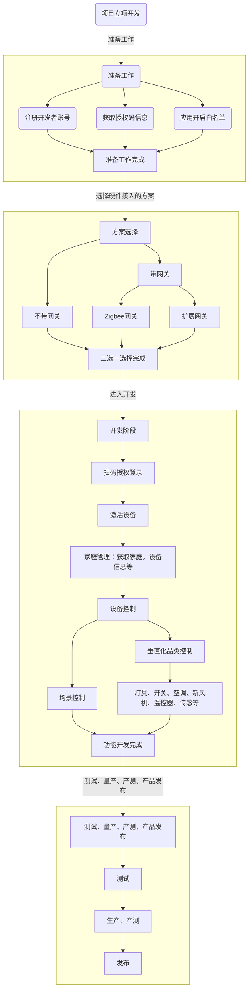

```mermaid
graph TB
    id1(项目立项开发)
    id2(准备工作)
    id3(注册开发者账号)
    id4(获取授权码信息)
    id5(应用开启白名单)
    id1 -->|准备工作|id2
    subgraph  
   		id2--> id3
   		id2--> id4
   		id2--> id5
   		id3--> 准备工作完成
   		id4--> 准备工作完成
   		id5--> 准备工作完成
    end  
    准备工作完成 -->|选择硬件接入的方案|方案选择
    subgraph  
      方案选择 --> 带网关
      方案选择 --> 不带网关
      带网关--> Zigbee网关
      带网关--> 扩展网关
      不带网关 --> 三选一选择完成
      Zigbee网关 --> 三选一选择完成
      扩展网关 --> 三选一选择完成
    end  
    三选一选择完成-->|进入开发|开发阶段
    subgraph  
    	开发阶段 --> 扫码授权登录
    	扫码授权登录 --> 激活设备
    	激活设备 --> 家庭管理["家庭管理：获取家庭，设备信息等"]
    	家庭管理  -->  设备控制
    	设备控制 --> 垂直化品类控制
    	设备控制 --> 场景控制
    	垂直化品类控制 --> 品类["灯具、开关、空调、新风机、温控器、传感等"]
    	场景控制 --> 功能开发完成
    	品类--> 功能开发完成
    end 
    功能开发完成 -->|"测试、量产、产测、产品发布"| 测试流程["测试、量产、产测、产品发布"]
    subgraph  
			测试流程 --> 测试
			测试 --> 产测["生产、产测"]
			产测 --> 发布
    end 
```