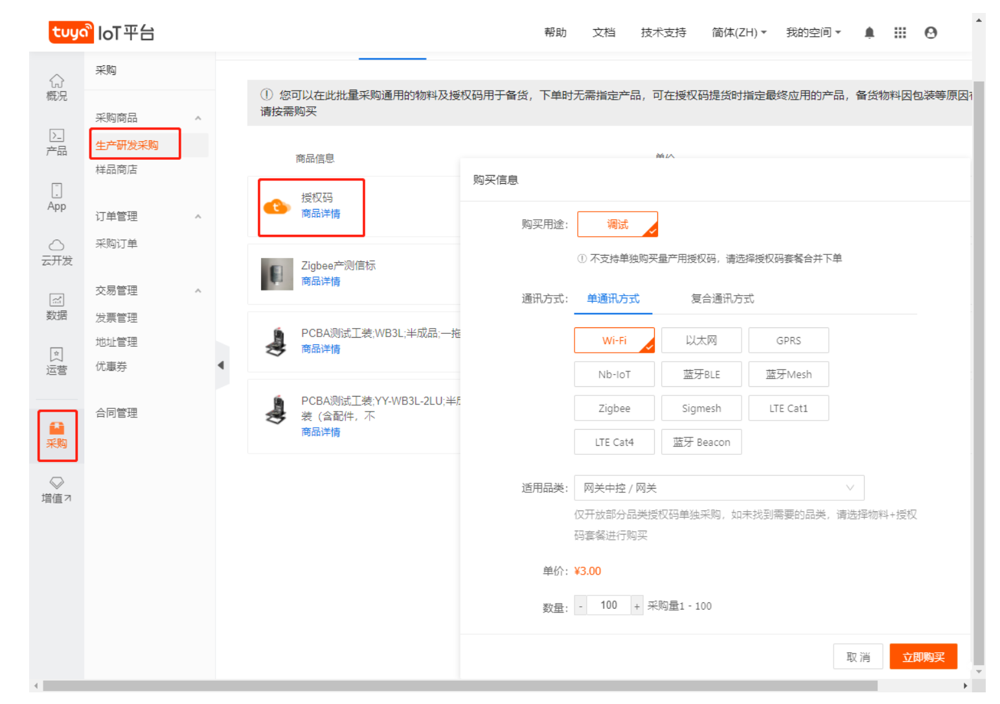
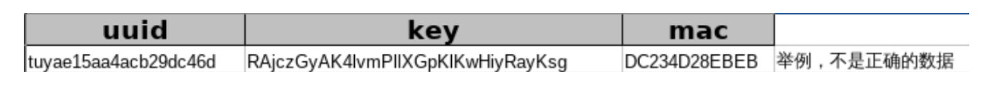

# **量产指导、产测相关的指导**

##  授权接口实现

产品的授权信息，采用 PID + UUID + AUTHKEY 的方式实现，需要从程序的 外部输入。量产时，可以采用烧入 flash 的方式来实现。

厂家需要设计一个上位机，能够逐条读取授权清单中的 pid/uuid/authkey， 写入到芯片的指定 flash 处，例如:(可以读取授权清单，写入芯片)

**代码里 pid/uuid/authkey 不能写死**，需要读取对应 flash 中的内容，对其进行初始化。

##  购买授权码

先期调试阶段，请联系涂鸦项目经理获取。

当开发的产品完成功能测试、稳定性测试、老化测试、拉距测试后，对产品进行发布，然后可在涂鸦 IoT 平台采购授权码。采购授权码前需要先创建产品。

订单成功后，在邮箱中会收到授权码清单(一个表格，将表格另存为 xlsx 格式，表格中内容格 式如下:)

