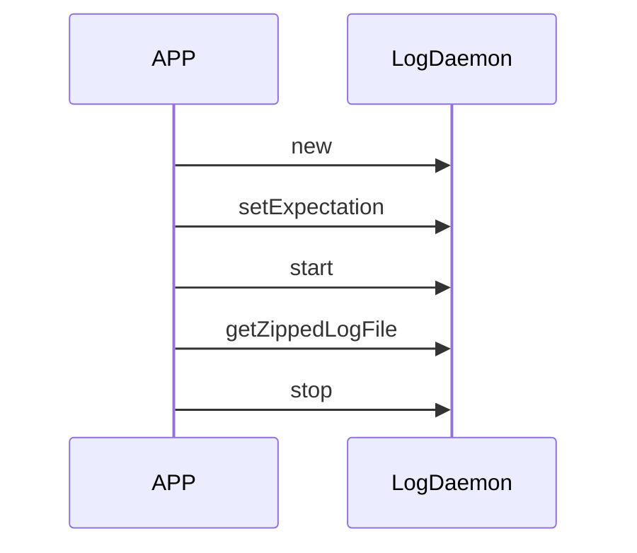

# 日志系统

## 创建 LogDeamon 对象

**接口说明**

```java
public LogDaemon(String logDir, int maxfileCount, int fileSizeKB, String prefixName);
```

**参数说明**

| 参数         | 说明                                                         |
| ------------ | ------------------------------------------------------------ |
| logDir       | 日志路径，如果路径没有创建，日志系统会创建该目录。           |
| maxfileCount | 备份的日志文件个数，不包括当前写的文件。                     |
| fileSizeKB   | 文件大小，当日志文件达到 fileSizeKB 指定大小时，会备份当前文件，如果备份的文件个数达到 maxfileCount 指定的值，则删除最老的一个文件。 |
| prefixName   | 日志文件名，最终生成日志文件 logDir/prefixName.log，备份文件为logDir/prefixName.log.1, logDir/prefixName.log.2... |

**示例代码**

```java
String filePath = getFilesDir().getAbsolutePath();
String logPath = filePath + File.separator + "log";

//logPath/gateawy.log
mLogDaemon = new LogDaemon(logPath, 10,3*1024, "gateway");
```

## 设置日志保存方式

**接口说明**

```java
public void setExpectation(int pid, String tags, boolean seperate)
```

**参数说明**

| 参数     | 说明                                                         |
| -------- | ------------------------------------------------------------ |
| pid      | -1：不按照进程抓取日志；正值：要抓取的进程id。               |
| tags     | 设置要抓取的 tag，多个 tag 用英文逗号分开，例如 “TuyaIotGateway,LogDaemon”，抓取Android LOG TAG 为 TuyaIotGateway 和 LogDaemon 的日志。 |
| seperate | 如果要通过 pid 和 tag 抓取日志，seperate 指定是否分开抓取，如果分开抓取，pid 一份 log，tag 一份 log；否则抓取 pid 中指定的 tag 日志。只有 pid 和 tag 同时有效时，该参数才有意义。 |

**示例代码**

- 收集指定进程的全部日志

	抓取本进程的所有日志：

	```java
	mLogDaemon.setExpectation(android.os.Process.myPid(),  null, false);
	mLogDaemon.start();
	```

- 收集指定进程中符合 tag 的日志

	抓取本进程中 tag 为 TuyaIotGateway 和 LogDaemon 的日志：

	```java
	mLogDaemon.setExpectation(android.os.Process.myPid(),  "TuyaIotGateway,LogDaemon", false);
	mLogDaemon.start();
	```

- 收集指定 tag 的日志

	抓取 tag 为 TuyaIotGateway和 LogDaemon 的日志：

	```java
	mLogDaemon.setExpectation(-1,  "TuyaIotGateway,LogDaemon", false);
	mLogDaemon.start();
	```

- 收集指定 pid 的日志和指定 tag 的日志，输出两份日志

	分别抓取本进程所有日志以及 tag 为 TuyaIotGateway 和 LogDaemon 的日志的日志。

	```java
	mLogDaemon.setExpectation(android.os.Process.myPid(),  "TuyaIotGateway,LogDaemon", true);
	mLogDaemon.start();
	```

## 开始日志保存

**接口说明**

```java
public boolean start();
```

## 停止日志保存

**接口说明**

设备退出或者重启 app 进程时，请务必也退出日志系统，因为日志系统内部起了 logcat 进程。

```java
public void stop();
```

## 获取日志文件

**接口说明**

该接口会将日志目录下的所有日志文件打包为一个 zip 文件。

```java
public String getZippedLogFile()；
```

## 日志保存流程



# 测试套件

libtestsuit 是封装的 zigBee 测试库，主要给产测工具用，调用方法：

1. 创建 ZigbeeTestSuit.Config 对象，并按说明配置参数。这个 config 和 TuyaIotGateway.Config 基本一致。
2. 注册回调函数 ZigbeeTestSuit.OnTestCompletion
3. 调用 tuyaZigbeeTest 开始测试
4. 在回调函数中检测测试结果，ZigbeeTestSuit.TEST_OK 为测试通过，其它为错误值 ZigbeeTestSuit.TEST_* 之一。

> 参考 demo ./app/src/main/java/com/tuya/smart/android/demo/test/ZigbeeTest.java中的调用方式。

# 语音相关

## 控制状态定义

```java
TuyaIotGateway.VoiceControl.VOICE_MIC_OPEN = 1,		//麦克风开启
TuyaIotGateway.VoiceControl.VOICE_MIC_CLOSE = 2, 	//麦克风关闭
TuyaIotGateway.VoiceControl.VOICE_PLAY = 3,			//播放
TuyaIotGateway.VoiceControl.VOICE_PAUSE = 4,			//暂停
TuyaIotGateway.VoiceControl.VOICE_BT_PLAY_OPEN = 5,	//打开蓝牙
TuyaIotGateway.VoiceControl.VOICE_BT_PLAY_CLOSE = 6,//关闭蓝牙
TuyaIotGateway.VoiceControl.VOICE_PLAY_NEXT = 7,     //下一首
TuyaIotGateway.VoiceControl.VOICE_PLAY_PREV = 8,		//上一首
```

## 语音控制初始化

**接口说明**

```java
void setVoiceCapableCallback(VoiceCapableCallback callback)
```

**参数说明**

| 参数     | 说明         |
| -------- | ------------ |
| callback | 语音能力回调 |

**示例代码**

```java
TuyaIotGateway.getInstance().setVoiceCapableCallback(new VoiceCapableCallback() {

		void onVolume(int volume) {
			 TODO("音量变化回调：volume 音量")
		}
		
		void onControl(int control) {
			 TODO("媒体控制回调: control 媒体控制状态")
		}
		
		void onAlarm(String alarm) {
			 TODO("闹钟回调: alarm 闹钟名称")
		}
	
	}
)
```

## 音量上报

 **接口说明**

DP上报音量值，在音量改变的情况下，调用此接口。

```java
int voiceCapableReportVol(int volume)
```

**参数**

| 参数名 | 描述   |
| ------ | ------ |
| volume | 音量值 |

**返回值**

0 : 成功； 其他：失败错误码

**示例代码**

```java
TuyaIotGateway.getInstance().voiceCapableReportVol(0)
```

## 媒体控制上报

**接口说明**

DP上报媒体控制状态，在媒体控制状态改变的情况下，调用此接口。

```java
int voiceCapableReportCtl(int control)
```

**参数**

| 参数名  | 描述         |
| ------- | ------------ |
| control | 媒体控制状态 |

**返回值**

0 : 成功； 其他：失败错误码

**示例代码**

```java
TuyaIotGateway.getInstance().voiceCapableReportCtl(TuyaIotGateway.VoiceControl.VOICE_PLAY);
```

## 语音上报接口

**接口说明**

设备端上报语音数据，依次调用开启、上传、结束接口。

**示例代码**

```java
//开启上传;返回值：0(成功)；其他(失败错误码)
TuyaIotGateway.getInstance().tuyaIotUploadMediaStart();

//上传语音数据；参数buffer 音频数据;返回值：0(成功)；其他(失败错误码)
TuyaIotGateway.getInstance().tuyaIotUploadMedia(byte[] buffer);

//结束上传;返回值：0(成功)；其他(失败错误码)
TuyaIotGateway.getInstance().tuyaIotUploadMediaStop();
```

## 语音服务接口

**接口说明**

设置多媒体数据以及定制数据接收回调，参考 [回调函数](https://github.com/TuyaInc/tuyasmart_android_device_central_sdk#回调函数) 中的说明。

**示例代码**

```java
TuyaIotGateway.getInstance().setGatewayListener(new TuyaIotGateway.GatewayListener() {
		
		···
		
		void onCloudMedia(TuyaIotGateway.MediaAttribute[] medias) {
			 TODO("接收云端下发tts报文。")
		}
		
		void onCloudCustom(String type, String msgJson) {
			 TODO("客户定制501透传接口函数，具体协议内容由云端与客户制定，并提供说明。")
		}
	}
)
```

## ATOP透传接口

**接口说明**

```java
ATopResponse atopPost(String api, String version, String postData);
```

**参数说明**

| 参数     | 说明                     |
| -------- | ------------------------ |
| api      | 接口名                   |
| version  | 接口版本                 |
| postData | 上报云端的数据json字符串 |

| 返回值       | 含义                                                         |
| ------------ | ------------------------------------------------------------ |
| ATopResponse | 包含errCode（错误码）和result（请求结果）两个字段。请求正常返回时errCode为0 |

**示例代码**

```java
ATopResponse response = TuyaIotGateway.getInstance().atopPost("tuya.xx.xx", "1.0", "");
if (response.errCode == 0) {
	Log.d(TAG, "result: " + response.result);
}
```

# OTA 升级

## 设置升级回调

**接口说明**

通过 TuyaIotGateway 单例设置回调实现

```java
void setUpgradeCallback(UpgradeEventCallback upgradeCallback);
```

**参数说明**

| 参数            | 说明         |
| --------------- | ------------ |
| upgradeCallback | OTA 事件回调 |

**回调说明**

```java
	public interface UpgradeEventCallback {

    /**
     * sdk 接收到后端的升级推送的时候，会触发此接口 附带升级信息
     * @param version
     */
    void onUpgradeInfo(String version);

    /**
     * 升级文件开始下载
     */
    void onUpgradeDownloadStart();

    /**
     * 升级文件下载进度
     */
    void onUpgradeDownloadUpdate(int progress);

    /**
     * sdk 下载升级文件下载完成触发此接口
     */
    void upgradeFileDownloadFinished(boolean success);

    /**
     * 升级失败
     * @param msg 错误信息
     */
    void onUpgradeFail(String msg);
	}
```

## 上传升级固件

1. 准备 ROM 升级文件 update.zip（非必须）

2. 打升级包 app.apk（必须）

3. 准备版本文件 version.json，内容为：

	```json
		{
			"apkVersion": "1.2.0",  // apk版本号
			"romVersion": "1565694425",   //  系统升级文件版本，升级压缩包的/META-INF/com/android/metadata `post-timestamp`
		}
	```

4. 将上面三个(或两个)文件压缩为 `标识名_OTA_版本号.bin`，例：`test_acs_rk3399-all_OTA_1.0.2.bin`

5. 在固件及版本管理后台上传

6. 在固件升级管理后台添加升级